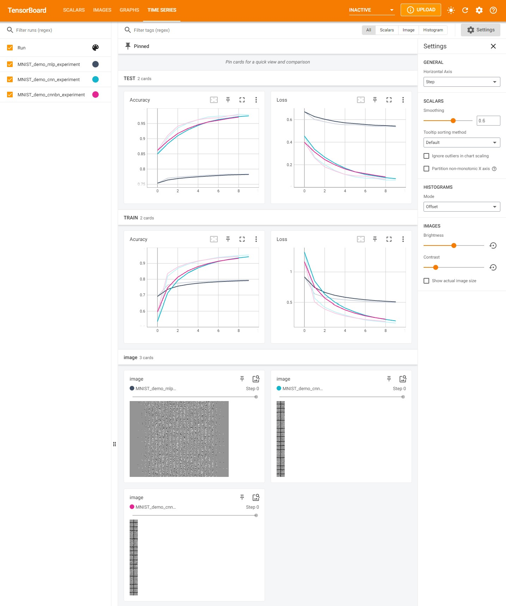

# 2021-2022学年卓越科协寒假集训深度学习Day5 

### MNIST手写数字识别

#### 要求：

------

##### 模型要求：

- 使用前馈神经网络进行训练预测
- 使用不带有Batch Normalization的卷积神经网络进行训练预测
- 使用不带有Batch Normalization的卷积神经网络进行训练预测

------

##### 代码实现要求：

- 数据读取
- 数据预处理：对训练集进行翻转、正则化等
- 使用不同的Optimizer：Adam、SGD，加入动态学习率等
- 训练测试函数的编写
- 绘制训练和测试的Loss/Accuracy曲线
- 最终对测试集进行预测并通过Matplotlib绘制

------

# 2021HDU_Honors_STA_DL_Day5
